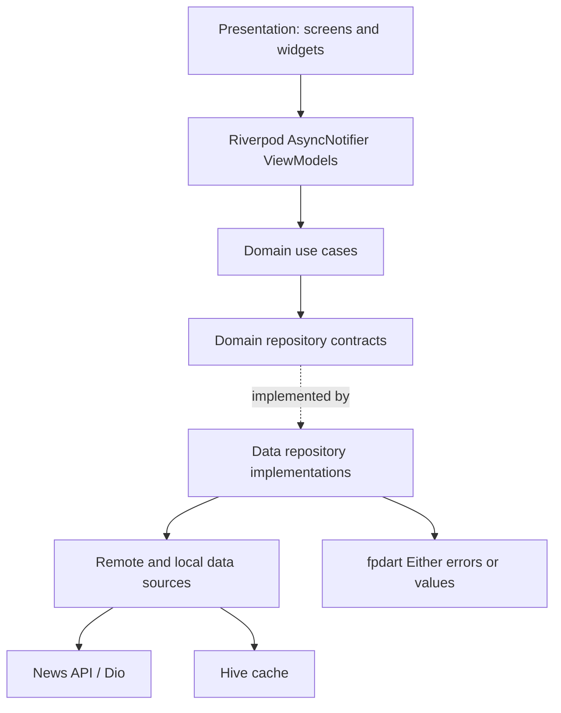

# Architecture and testing

## Feature boundary

The current codebase uses an explicit layer-first Clean Architecture layout (`lib/domain`, `lib/data`, and `lib/presentation`). This is valid when dependency direction is enforced: presentation depends on domain, data implements domain contracts, and domain does not depend on Flutter or infrastructure. A future feature-first migration should preserve these boundaries rather than duplicate them.



Riverpod `AsyncNotifier` is the ViewModel boundary. Widgets render loading, data, empty, and error states and never call Dio or Hive directly. Use cases contain one business operation and repositories hide source selection and mapping.

## Offline-first news flow

Hive stores the latest articles in `news_articles`. Reads can render cached data immediately; a successful remote response refreshes the box. Network timeout, connectivity, and HTTP failures fall back to the cache. If both sources are empty, the repository returns a typed failure through `Either` rather than fabricated data.

Expected news use-case surface:

- GetLatestNews
- SearchNews
- GetNewsByCategory
- GetBookmarkedNews
- BookmarkArticle
- RemoveBookmarkArticle

Bookmark operations should be idempotent and persist locally so they work offline.

## Test coverage checklist

Run:

```bash
flutter analyze
flutter test --coverage
```

The suite should cover:

- Remote data source: successful response, malformed/HTTP failure, timeout.
- Hive/local data source: read, write, empty cache, serialization failure.
- Repository: remote success, cache fallback, both sources failing, mapping and `Either` errors.
- Each use case: delegates correctly and propagates success/failure.
- News notifier: loading → data, loading → error, empty data, and offline/cache state.
- Widgets: loading indicator, populated list, empty state, error/retry, and bookmark interaction.

Coverage artifacts are written to `coverage/` by Flutter and should be reviewed alongside CI's analyze and test jobs.
